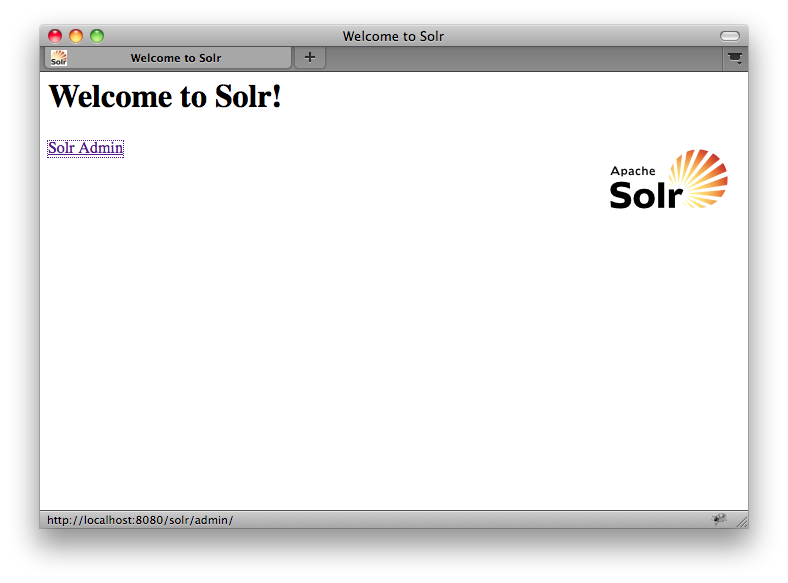
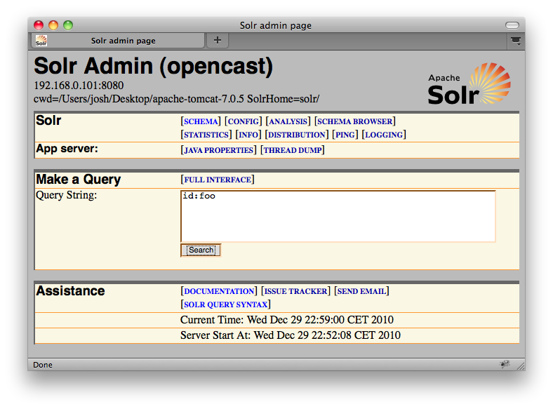
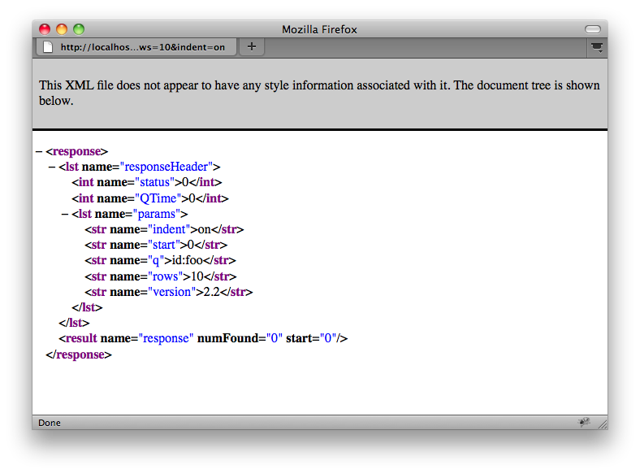

# Solr Configuration

*Opencast has Solr included by default. This guide is only needed, if you want to run Solr on a separate server.*

**The software versions in these instructions are not the only versions that will work, they are just the version tested
when this document was written.  Newer versions of both Tomcat and Solr are highly recommended.**

## Introduction

Opencast services use filesystem, relational database, and/or search indexes to store and retrieve information. In
order to cluster services across multiple servers, we must provide shared storage solutions for each of these
technologies. We do this with NFS or ZFS for filesystems, JDBC for relational databases, and solr for search indexes. If
you plan on clustering either the workflow service or the search service, you must configure Opencast to use remote
solr servers as described below, otherwise no further action is required.

## Obtaining the software
Solr runs in any modern servlet environment such as Apache Tomcat 7. Download and unpack Tomcat.

    $ curl -O http://archive.apache.org/dist/tomcat/tomcat-7/v7.0.5-beta/bin/apache-tomcat-7.0.5.zip
    $ unzip apache-tomcat-7.0.5.zip

Download solr from the closest mirror and unpack the zip file. Make sure the permissions are set properly (the zip file
doesn't retain proper unix permissions)

    $ curl -O http://archive.apache.org/dist/lucene/solr/1.4.1/apache-solr-1.4.1.zip
    $ unzip apache-solr-1.4.1.zip
    $ chmod 755 apache-tomcat-7.0.5/bin/*

## Deploy solr to tomcat
Copy the solr example war file to tomcat's webapps directory and expand the war file.

    $ unzip apache-solr-1.4.1/example/webapps/solr.war -d apache-tomcat-7.0.5/webapps/solr/

## Configure solr

Add the solr config files to the solr webapp in tomcat. If you are setting up the search service, use the solr config
from the search module.

    $ cd apache-tomcat-7.0.5
    $ cp -R [opencast source]/modules/search-service-impl/src/main/resources/solr solr

Alternatively, if this is the solr index supporting the workflow service, copy those files instead:

    $ cd apache-tomcat-7.0.5
    $ cp -R [opencast source]/modules/workflow-service-impl/src/main/resources/solr solr

Edit the dataDir setting in solr/conf/solrconfig.xml to specify the directory you want to use for the index files.

### *Dependency of the workflow index*

*The index has a dependency on a Opencast class. The easiest way of getting rid of this dependency is providing a .jar
file with that class within a directory named lib in the solr folder (you may need to create it if it does not exist).
The .jar file can be the compiled solr bundle. Placing the jar in the main Tomcat lib directory does not
work.*

## Start the server

    $ bin/startup.sh
    Using CATALINA_BASE:   /Users/josh/Desktop/apache-tomcat-7.0.5
    Using CATALINA_HOME:   /Users/josh/Desktop/apache-tomcat-7.0.5
    Using CATALINA_TMPDIR: /Users/josh/Desktop/apache-tomcat-7.0.5/temp
    Using JRE_HOME:        /System/Library/Frameworks/JavaVM.framework/Versions/CurrentJDK/Home

You should see that the solr server is running on http://localhost:8080/solr

You can use the admin screen to monitor the server or make ad-hoc queries:

## Secure the solr server

Just like with a relational database server, it is critical that you limit access to the solr server. Opencast's
communication with solr servers is unauthenticated, so you must secure a firewall on the solr servers that accepts HTTP
requests only from Opencast servers. If these servers were publicly accessible, anyone could make changes to
Opencast data from outside Opencast itself.

## Configure Opencast
Set the URL to this solr server in Opencast's custom.properties file:

    org.opencastproject.search.solr.url=http://your.solr.server.edu:8080/solr/

If this solr server is supporting clustered workflow services:

    org.opencastproject.workflow.solr.url==http://your.solr.server.edu:8080/solr/

*It is important to understand that a solr server provides exactly one schema, and one schema only. If you want to
cluster both the workflow service and the search service, you will need two separate solr servers. These solr servers
can run on the same machine, but each will needs its own servlet container and port.*
